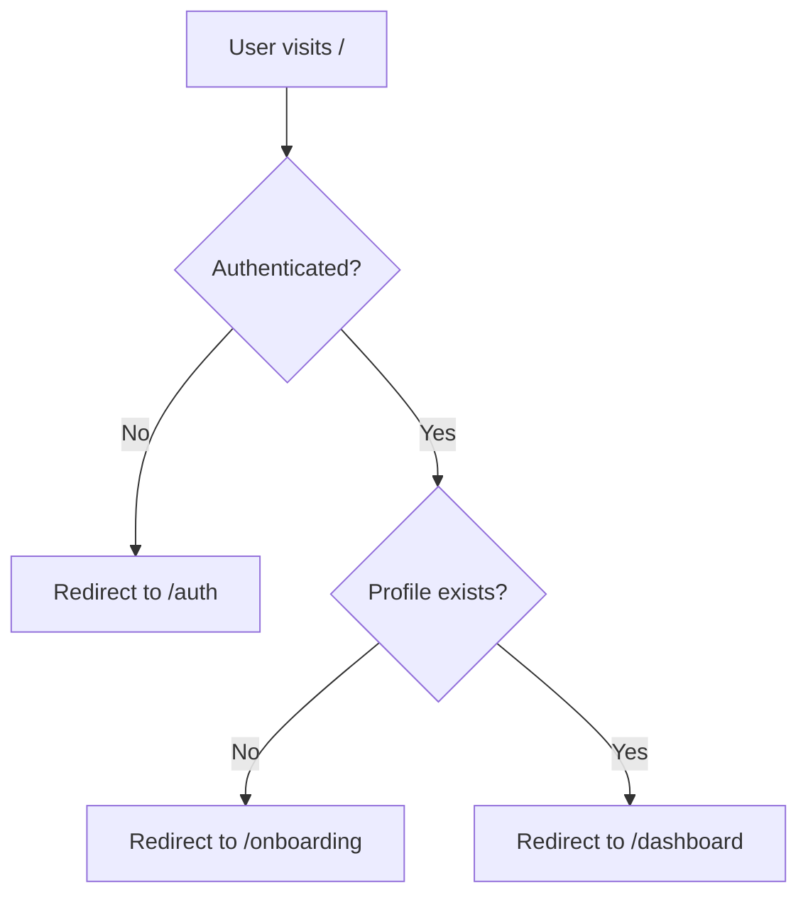
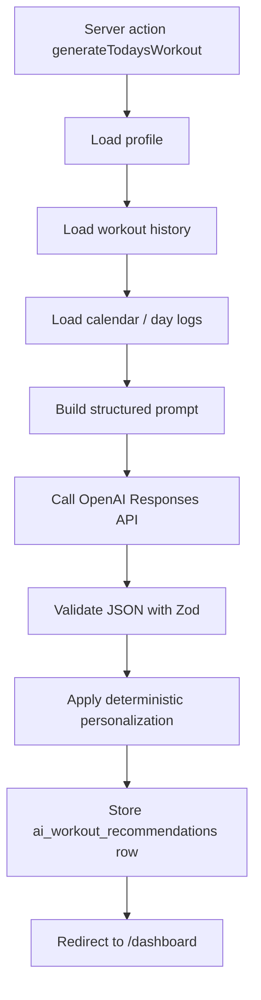

# Gym Buddy AI Technical README

This document is the engineering-focused companion to [README.md](</D:/work/GymBuddy/README.md>).

Use this file when you want to understand:

- how requests move through the app
- how Supabase auth and persistence are wired
- how AI workout generation works
- how progression is enforced
- how the database schema maps to runtime behavior
- where to edit the system safely

## 1. System Overview

Gym Buddy AI is a `Next.js App Router` application that combines:

- server-rendered route guards
- Supabase authentication and persistence
- OpenAI-based workout generation
- deterministic workout personalization after model output
- mobile-first UI components for execution and feedback

At a high level, the architecture is:

1. The user signs in with Supabase Auth.
2. The app routes the user to onboarding or dashboard based on whether a profile exists.
3. The dashboard loads profile, recommendation, workout history, and activity timeline data from Supabase.
4. When the user generates a workout, the backend composes structured context and sends it to OpenAI.
5. The model returns a structured workout draft.
6. Backend personalization logic applies deterministic progression and other adjustments.
7. The final recommendation is stored in Supabase.
8. The user logs feedback on cards.
9. When the session is completed, the recommendation is converted into permanent workout history rows.

## 2. Stack and Runtime Responsibilities

### Frontend

- `Next.js 15`
- `React 19`
- `TypeScript`
- `Tailwind CSS`

### Backend inside the app

- `Next.js server components`
- `Next.js server actions`
- `Next.js route handlers`

### Database and auth

- `Supabase Auth`
- `Supabase Postgres`
- `Supabase Row Level Security`

### AI and validation

- `OpenAI Responses API`
- `Zod`

### Key design choice

The LLM is used for workout planning structure, not final progression authority.

The app deliberately splits responsibilities like this:

- AI decides the session outline and exercise plan
- backend logic decides deterministic progression on repeated exercises
- database stores durable workout history and continuity signals

This separation is important for consistency and future maintainability.

## 3. Route Map

### Public entry / routing

- [app/page.tsx](</D:/work/GymBuddy/app/page.tsx>)
  Root route that redirects users to `/auth`, `/onboarding`, or `/dashboard`.

### Authentication

- [app/auth/page.tsx](</D:/work/GymBuddy/app/auth/page.tsx>)
  Auth landing page.

- [components/auth-form.tsx](</D:/work/GymBuddy/components/auth-form.tsx>)
  Client-side sign up and sign in form using Supabase browser auth.

### Profile and onboarding

- [app/onboarding/page.tsx](</D:/work/GymBuddy/app/onboarding/page.tsx>)
  Profile creation and editing entry.

- [lib/actions/profile.ts](</D:/work/GymBuddy/lib/actions/profile.ts>)
  Persists profile, limitations, and long-term special requests.

- [lib/data/profile.ts](</D:/work/GymBuddy/lib/data/profile.ts>)
  Reads profile data from Supabase.

### Main product screens

- [app/dashboard/page.tsx](</D:/work/GymBuddy/app/dashboard/page.tsx>)
  Main home screen for workout generation and workout execution.

- [app/calendar/page.tsx](</D:/work/GymBuddy/app/calendar/page.tsx>)
  Calendar and day-log review page.

- [app/profile/page.tsx](</D:/work/GymBuddy/app/profile/page.tsx>)
  Profile summary and edit entry point.

### API / server orchestration

- [lib/actions/workouts.ts](</D:/work/GymBuddy/lib/actions/workouts.ts>)
  Main server actions for:
  - generating workouts
  - saving day logs
  - saving per-card feedback
  - converting today’s recommendation into permanent workout history

- [app/api/workout-plan/route.ts](</D:/work/GymBuddy/app/api/workout-plan/route.ts>)
  Additional route handler that also uses the OpenAI pipeline.

## 4. Auth Architecture

### Client auth

Client-side auth uses [lib/supabase/client.ts](</D:/work/GymBuddy/lib/supabase/client.ts>), which creates a browser Supabase client using:

- `NEXT_PUBLIC_SUPABASE_URL`
- `NEXT_PUBLIC_SUPABASE_PUBLISHABLE_KEY`, falling back to `NEXT_PUBLIC_SUPABASE_ANON_KEY`

The sign-in and sign-up form lives in [components/auth-form.tsx](</D:/work/GymBuddy/components/auth-form.tsx>).

Important behavior:

- sign-up uses `window.location.origin` to build the email redirect target
- sign-in uses `supabase.auth.signInWithPassword`
- auth fetch failures are surfaced with a clearer Supabase-specific error

### Server auth

Server-side auth uses [lib/supabase/server.ts](</D:/work/GymBuddy/lib/supabase/server.ts>), which creates a cookie-aware server client using `next/headers`.

This is used by:

- route guards
- server actions
- data readers

### Middleware

[middleware.ts](</D:/work/GymBuddy/middleware.ts>) initializes a Supabase server client for request-time cookie synchronization and calls `supabase.auth.getUser()` to keep auth state aligned.

### Auth routing flow



## 5. Data Model

The canonical schema is in [supabase/schema.sql](</D:/work/GymBuddy/supabase/schema.sql>).

### `profiles`

Purpose:

- stores one long-term training profile per authenticated user

Important fields:

- `user_id`
- `goal`
- `experience_level`
- `training_days_per_week`
- `session_length_minutes`
- `preferred_location`
- `available_equipment`

### `profile_limitations`

Purpose:

- stores constraint records attached to a profile

Examples:

- injury
- equipment missing
- movement dislike
- schedule restriction

### `profile_special_requests`

Purpose:

- stores long-term planning preferences the user wants remembered

### `workout_sessions`

Purpose:

- stores permanent completed workout sessions

Important fields:

- `performed_at`
- `focus`
- `intensity`
- `duration_minutes`
- `muscle_groups_hit`
- `notes`
- `summary_text`

### `workout_exercises`

Purpose:

- stores each exercise belonging to a completed workout session

Important fields:

- prescription:
  - `sets_count`
  - `reps_text`
  - `rest_seconds`
  - `warmup`
  - `tips`
  - `substitute`
- personalization:
  - `load_guidance`
  - `last_performance`
  - `intensity_target`
  - `tempo`
  - `advanced_technique`
  - `fatigue_note`
- feedback:
  - `completion_status`
  - `difficulty_feedback`
  - `logged_weight`
  - `logged_reps`
  - `logged_sets`
  - `logged_rpe`
  - `feedback_notes`

### `workout_day_logs`

Purpose:

- stores continuity information at the day level

Supported statuses:

- `completed_elsewhere`
- `rest_day`
- `missed`

This table is how the system knows whether a gap in in-app workouts is:

- a true miss
- an outside workout
- intentional recovery

### `ai_workout_recommendations`

Purpose:

- stores the current generated recommendation for a given date

This acts as a daily working document before the workout is finalized into `workout_sessions` and `workout_exercises`.

## 6. Shared Type Contracts

[lib/types.ts](</D:/work/GymBuddy/lib/types.ts>) is the main contract layer shared across the app.

Important domains defined there:

- user goal and equipment enums
- experience levels
- workout day statuses
- workout recommendation shape
- workout exercise feedback shape
- workout progression shape

This file matters because several layers depend on it simultaneously:

- UI components
- data readers
- server actions
- AI normalization
- deterministic progression logic

If these contracts drift, type checking will catch some issues, but runtime data mismatch can still occur if the DB schema and AI schema are not updated in sync.

## 7. Workout Generation Pipeline

The core generator is [lib/ai/generate-workout.ts](</D:/work/GymBuddy/lib/ai/generate-workout.ts>).

### Inputs to generation

The generator receives:

- `profile`
- `recentSessions`
- `recentActivityTimeline`
- optional `todaySpecialRequest`

### Preprocessing before the model call

The generator slices the workout history into two buckets:

- recent exact sessions:
  - last 10 sessions
  - includes exercises, performed time, and duration
- older summaries:
  - next 10 sessions
  - summary-only context

This prevents the prompt from becoming too large while preserving recent exact context.

### Prompt builder

[lib/ai/workout-prompt.ts](</D:/work/GymBuddy/lib/ai/workout-prompt.ts>) builds the prompt and defines the JSON schema expected back from the model.

Important prompt rules:

- respect equipment and limitations
- use adherence and missed-day signals
- scale complexity by experience level
- avoid vague progression language
- return valid JSON only

### Model call

The current model call uses:

- `client.responses.create(...)`
- model: `gpt-4.1-mini`
- output type: `json_schema`

### Validation and normalization

After receiving `response.output_text`:

1. the app parses the JSON
2. validates it against [lib/ai/validation.ts](</D:/work/GymBuddy/lib/ai/validation.ts>)
3. normalizes nullable fields into internal optional fields

This is important because OpenAI strict JSON schema output requires fields to exist even when they are `null`.

### Post-model personalization

The raw exercise list is passed into:

- [lib/workout-personalization.ts](</D:/work/GymBuddy/lib/workout-personalization.ts>)

That layer applies deterministic progression and experience-aware defaults.

### Generation flow diagram



## 8. Deterministic Progression Engine

The most important business logic lives in [lib/workout-personalization.ts](</D:/work/GymBuddy/lib/workout-personalization.ts>).

### Why it exists

Pure LLM-based progression is too inconsistent for repeated exercises.

The app therefore computes progression decisions in code after generation.

### Key logic steps

1. Normalize exercise names.
2. Find the most recent matching exercise in session history.
3. Parse previous logged weight.
4. Parse the rep target for the new exercise.
5. Choose a next action based on feedback and performance.

### Main progression rules

- `too_hard` -> decrease one clear step
- `too_easy` -> increase one clear step
- `need_alternative` -> easier option
- `need_clarity` -> maintain load and focus on form confidence
- reached top of rep range -> increase
- below rep minimum -> maintain
- incomplete data -> stable fallback
- no history -> baseline start instruction

### Output shape

Each exercise can receive a `progression` object:

- `action`
- `label`
- `instruction`
- `reason`
- optional `targetWeight`
- `source`

This output feeds the UI so progression is visible instead of buried.

## 9. Workout Persistence Lifecycle

The key workflow is implemented in [lib/actions/workouts.ts](</D:/work/GymBuddy/lib/actions/workouts.ts>).

### A. Generate today's workout

`generateTodaysWorkout(formData)`:

1. ensures the user is onboarded
2. prevents duplicate generation if today’s recommendation already exists
3. loads unresolved calendar gaps
4. requires day-status answers for unresolved dates
5. calls the AI pipeline
6. upserts today’s row into `ai_workout_recommendations`
7. redirects back to dashboard

### B. Save day-level continuity answers

`upsertWorkoutDayLogs(...)`:

- upserts `workout_day_logs`
- conflict target: `profile_id,activity_date`

This makes the day-log flow idempotent for the same user and date.

### C. Save per-card feedback

`saveExerciseCardFeedback(formData)`:

1. validates the payload with Zod
2. loads today’s recommendation
3. updates a single exercise in the `exercises` JSON array
4. rewrites the recommendation row
5. revalidates dashboard

This means feedback is stored before the session is finalized.

### D. Mark workout done

`markTodaysWorkoutDone()`:

1. reads the current recommendation
2. inserts one row into `workout_sessions`
3. inserts one row per exercise into `workout_exercises`
4. deletes the current `ai_workout_recommendations` row
5. revalidates and redirects

This effectively converts a temporary daily working document into permanent history.

## 10. Calendar and Activity Timeline Logic

The app distinguishes between:

- `completed_in_app`
- `completed_elsewhere`
- `rest_day`
- `missed`
- `unresolved`
- `idle`

Runtime types for those states live in [lib/types.ts](</D:/work/GymBuddy/lib/types.ts>), while data assembly lives in [lib/data/workouts.ts](</D:/work/GymBuddy/lib/data/workouts.ts>).

### Why this matters

Many fitness apps only know what happened inside the app.

Gym Buddy AI explicitly models missing context so the AI can answer:

- did the user actually skip training?
- did they train elsewhere?
- did they intentionally rest?

That context changes recovery and progression decisions.

## 11. Data Access Layer

The main workout query layer is [lib/data/workouts.ts](</D:/work/GymBuddy/lib/data/workouts.ts>).

Responsibilities include:

- loading today’s recommendation
- loading recent workout history
- loading recent day logs
- constructing calendar views
- deriving unresolved dates

The profile query layer is [lib/data/profile.ts](</D:/work/GymBuddy/lib/data/profile.ts>).

This separation keeps page components relatively thin:

- pages orchestrate UI
- data modules shape Supabase reads
- action modules handle mutations

## 12. Security Model

Supabase Row Level Security is enabled on all user-owned tables in [supabase/schema.sql](</D:/work/GymBuddy/supabase/schema.sql>).

### Policy pattern

Every policy ultimately resolves to one rule:

- an authenticated user can only access rows that belong to a `profile` owned by `auth.uid()`

There are two policy styles used:

- direct ownership:
  - `profiles.user_id = auth.uid()`
- ownership through joins:
  - `workout_exercises` joins through `workout_sessions` -> `profiles`

### Practical effect

Even if a client knows another row ID, Supabase should still reject access as long as policies remain correct.

## 13. Environment Variables and Their Roles

Current environment variables:

```env
NEXT_PUBLIC_SUPABASE_URL=
NEXT_PUBLIC_SUPABASE_PUBLISHABLE_KEY=
NEXT_PUBLIC_SUPABASE_ANON_KEY=
SUPABASE_SERVICE_ROLE_KEY=
OPENAI_API_KEY=
```

### Usage by layer

- browser Supabase client:
  - `NEXT_PUBLIC_SUPABASE_URL`
  - `NEXT_PUBLIC_SUPABASE_PUBLISHABLE_KEY`
  - fallback: `NEXT_PUBLIC_SUPABASE_ANON_KEY`
- server Supabase client:
  - same public URL and publishable key
- OpenAI generation:
  - `OPENAI_API_KEY`

### Important operational note

If the Supabase project is paused or deleted, browser auth typically fails as:

- `net::ERR_NAME_NOT_RESOLVED`
- `TypeError: Failed to fetch`

This is operationally important because it looks like a frontend auth bug, but the real cause is backend unavailability.

## 14. Caching, Revalidation, and Mutability

The app currently uses a simple mutation strategy:

- write data via server actions
- call `revalidatePath("/dashboard")` where relevant
- redirect back to the dashboard

This keeps the app relatively easy to reason about.

### Current tradeoff

Pros:

- simple mental model
- fewer stale state issues
- easy to debug

Cons:

- some dashboard data is recomputed often
- limited fine-grained caching
- recommendation JSON updates rewrite the whole exercise array

This is acceptable for the current project scale, but future optimization may include:

- finer invalidation boundaries
- memoized timeline shaping
- partial feedback persistence patterns

## 15. Known Technical Risks

### 1. Recommendation row as mutable JSON

The `ai_workout_recommendations.exercises` column stores the working recommendation as JSON.

Benefit:

- easy to persist a full generated plan

Tradeoff:

- updating one exercise rewrites the whole JSON payload

### 2. Exercise history matching by normalized name

Progression history currently matches by normalized exercise name text.

Benefit:

- fast to implement

Tradeoff:

- synonyms or renamed exercises can break continuity

Future improvement:

- introduce canonical exercise IDs

### 3. AI dependency for generation

If OpenAI is unavailable or returns invalid structure, workout generation fails.

Current mitigation:

- strict schema validation
- deterministic post-processing

Future improvement:

- fallback template-based generation

### 4. Limited automated testing

The system has strong logic in code, but progression rules should eventually be covered with explicit tests.

Most valuable future test targets:

- progression decisions
- workout completion persistence
- unresolved-day enforcement
- auth redirect behavior

## 16. Safe Change Guide

If you are editing the project, use these rules.

### When changing workout generation

Check all of:

- [lib/ai/workout-prompt.ts](</D:/work/GymBuddy/lib/ai/workout-prompt.ts>)
- [lib/ai/validation.ts](</D:/work/GymBuddy/lib/ai/validation.ts>)
- [lib/ai/generate-workout.ts](</D:/work/GymBuddy/lib/ai/generate-workout.ts>)
- [lib/types.ts](</D:/work/GymBuddy/lib/types.ts>)
- [components/workout-card.tsx](</D:/work/GymBuddy/components/workout-card.tsx>)

### When changing progression behavior

Check all of:

- [lib/workout-personalization.ts](</D:/work/GymBuddy/lib/workout-personalization.ts>)
- [components/workout-card.tsx](</D:/work/GymBuddy/components/workout-card.tsx>)
- [lib/actions/workouts.ts](</D:/work/GymBuddy/lib/actions/workouts.ts>)
- any historical fields in [supabase/schema.sql](</D:/work/GymBuddy/supabase/schema.sql>)

### When changing database fields

Update all of:

- `supabase/schema.sql`
- any migration files under `supabase/migrations`
- data readers
- server actions
- shared types
- README and this technical README

### When changing auth flow

Check all of:

- [components/auth-form.tsx](</D:/work/GymBuddy/components/auth-form.tsx>)
- [lib/supabase/client.ts](</D:/work/GymBuddy/lib/supabase/client.ts>)
- [lib/supabase/server.ts](</D:/work/GymBuddy/lib/supabase/server.ts>)
- [middleware.ts](</D:/work/GymBuddy/middleware.ts>)
- Supabase Auth URL configuration in the dashboard

## 17. Local Development Checklist

To get the technical stack running locally:

1. Ensure `.env.local` has valid Supabase and OpenAI values.
2. Ensure the target Supabase project is active and not paused.
3. Run the schema in Supabase SQL Editor.
4. Start the app with `npm run dev`.
5. Test:
   - `/auth`
   - `/onboarding`
   - `/dashboard`
   - `/calendar`
6. Generate a workout and complete one session.
7. Verify feedback writes to today’s recommendation.
8. Verify completion writes to `workout_sessions` and `workout_exercises`.

## 18. Recommended Next Technical Improvements

If you want to make the codebase more robust, the highest-value next steps are:

1. Add automated tests for progression rules.
2. Introduce canonical exercise IDs instead of name matching.
3. Split mutable recommendation exercise feedback into a more structured persistence model if scale grows.
4. Add clearer user-facing failure states for paused Supabase projects and AI outages.
5. Add observability around generation errors and auth failures.

## 19. Quick Reference

### Core files

- [app/page.tsx](</D:/work/GymBuddy/app/page.tsx>)
- [components/auth-form.tsx](</D:/work/GymBuddy/components/auth-form.tsx>)
- [lib/actions/workouts.ts](</D:/work/GymBuddy/lib/actions/workouts.ts>)
- [lib/data/workouts.ts](</D:/work/GymBuddy/lib/data/workouts.ts>)
- [lib/ai/generate-workout.ts](</D:/work/GymBuddy/lib/ai/generate-workout.ts>)
- [lib/ai/workout-prompt.ts](</D:/work/GymBuddy/lib/ai/workout-prompt.ts>)
- [lib/ai/validation.ts](</D:/work/GymBuddy/lib/ai/validation.ts>)
- [lib/workout-personalization.ts](</D:/work/GymBuddy/lib/workout-personalization.ts>)
- [lib/types.ts](</D:/work/GymBuddy/lib/types.ts>)
- [supabase/schema.sql](</D:/work/GymBuddy/supabase/schema.sql>)

### Main runtime lifecycle

`Auth -> Profile -> Generate -> Personalize -> Store recommendation -> Log feedback -> Finalize session -> Feed next recommendation`
